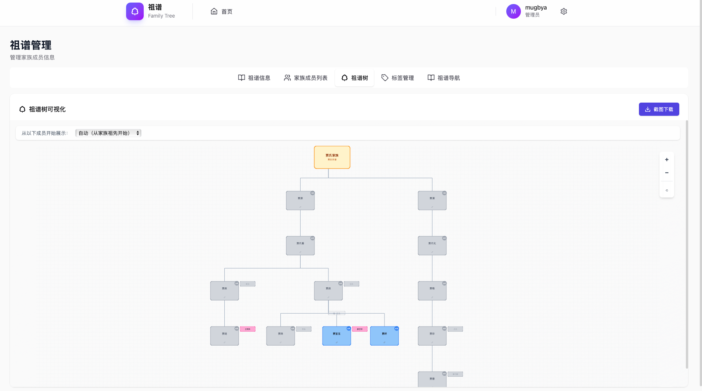
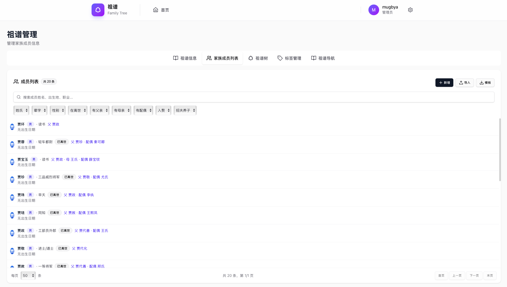
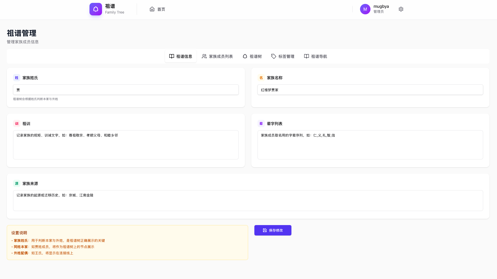
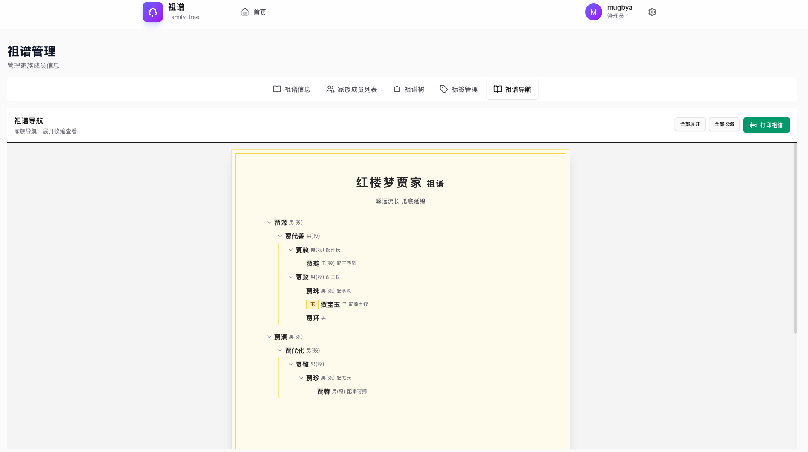

# 祖谱 Tree - 家祖谱系管理软件

一款基于 **Tauri 2.0 + React 19 + TypeScript** 构建的跨平台桌面祖谱管理软件。


## 功能特点

### 核心功能
- **祖谱树可视化** - 交互式家祖谱系树形图展示
- **成员管理** - 添加、编辑和查看家族成员信息
- **关系标签** - 可自定义的关系标签，支持颜色分类
- **数据导入导出** - 支持 CSV 和 Excel 导入

### 用户角色
| 角色 | 权限 |
|------|------|
| **管理员** | 完整权限：管理成员、编辑祖谱信息、管理标签、系统设置 |
| **普通用户** | 只读权限：查看家族成员、查看祖谱信息 |

### 主要特性
- **跨平台** - 支持 macOS、Windows 和 Linux
- **本地优先** - 数据本地存储，无需云端
- **多设备访问** - HTTP 服务器（端口 8080）支持局域网浏览器访问
- **桌面集成** - 系统托盘、开机自启支持

## 截图

- 首页家族统计

- 祖谱树可视化

- 成员列表

- 祖谱信息设置

- 祖谱导航


## 技术栈

| 层次 | 技术 |
|------|------|
| 前端框架 | React 19.1.0 |
| 开发语言 | TypeScript 5.8.3 |
| 构建工具 | Vite 7.0.4 |
| 桌面框架 | Tauri 2.x |
| 后端语言 | Rust |
| HTTP 服务 | Axum 0.7 |
| 包管理器 | pnpm 10.11.0 |
| 数据库 | SQLite 3 |
| 可视化 | react-d3-tree 3.6.6 |

## 项目结构

```
genealogy-tree/
├── src/                      # React 前端源码
│   ├── main.tsx             # React 入口
│   ├── App.tsx              # 主应用组件
│   ├── pages/               # 页面组件
│   │   ├── LoginPage.tsx   # 登录/注册
│   │   ├── HomePage.tsx    # 首页仪表盘
│   │   ├── TreePage.tsx     # 祖谱树与成员
│   │   └── SettingsPage.tsx # 系统配置
│   ├── components/           # 可复用组件
│   ├── api/                 # API 客户端
│   └── stores/              # 状态管理
│
├── src-tauri/              # Tauri/Rust 后端
│   ├── src/
│   │   ├── lib.rs          # Rust 入口
│   │   ├── api/            # HTTP API 处理器
│   │   ├── auth.rs         # JWT 认证
│   │   ├── db.rs           # 数据库初始化
│   │   └── models.rs       # 数据模型
│   ├── Cargo.toml          # Rust 依赖
│   └── tauri.conf.json     # Tauri 配置
│
├── package.json            # NPM 依赖
├── vite.config.ts          # Vite 配置
└── tsconfig.json           # TypeScript 配置
```

## 快速开始

### 环境要求
- Node.js 18+
- pnpm 10.11.0+
- Rust 1.70+
- Tauri CLI 2.x

### 安装

```bash
# 安装依赖
pnpm install

# 启动前端开发服务器
pnpm dev

# 启动 Tauri 桌面应用（在另一个终端）
pnpm tauri dev
```

### 构建

```bash
# 构建前端
pnpm build

# 构建 Tauri 应用
pnpm tauri build
```

## API 接口

| 方法 | 路径 | 描述 | 认证 |
|------|------|------|------|
| GET | `/api/health` | 健康检查 | 否 |
| POST | `/api/auth/register` | 注册账号 | 否 |
| POST | `/api/auth/login` | 登录 | 否 |
| GET | `/api/users/me` | 获取当前用户 | 是 |
| GET | `/api/admin/users` | 获取所有用户 | 管理员 |
| GET/POST | `/api/members` | 成员列表/创建 | - |
| GET/PUT/DELETE | `/api/members/:id` | 成员详情/更新/删除 | - |
| GET/POST | `/api/member-relations` | 关系列表/创建 | - |
| GET/POST | `/api/relation-tags` | 标签列表/创建 | - |

## 配置说明

### 数据库路径

数据库存储在应用数据目录：
- **macOS**: `~/Library/Application Support/com.genealogy-tree/.genealogy.db`
- **Linux**: `~/.config/genealogy-tree/.genealogy.db`
- **Windows**: `%APPDATA%\com.genealogy-tree\.genealogy.db`

### HTTP 服务器

桌面应用在端口 8080 启动 HTTP 服务器，支持局域网访问：
```
http://localhost:8080          # 本地访问
http://<您的IP>:8080          # 局域网访问
```

## 许可证

MIT 许可证
